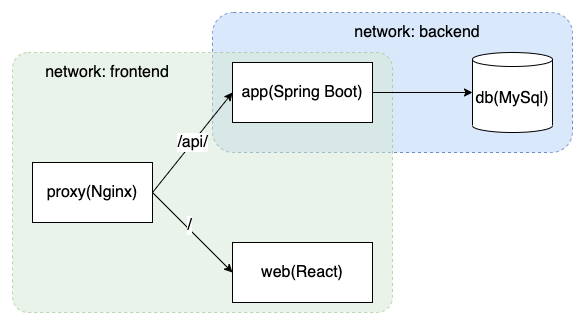

# Docker & Docker compose
## 架构
系统架构如图:   

## 遇到的坑及解决方案
1. 连接Mysql失败的问题  
   - 问题描述：使用`docker compose up`启动容器时，虽然app依赖于db，比db先启动，但是db初始化太慢，app启动之后尝试连接db时，db还没初始化好，不会响应app，导致app连接db失败，从而启动失败。  
   - 当前解决方案：db初始化成果后再次启动app  
   - 是否有更好的解决方案，如Spring Boot连接数据库retry机制？
2. Kotlin class作为`Entity`时必须要有无参构造函数  
   - 问题描述：如app中使用Kotlin class作为`Entity`，而Spring要求`Entity`必须要有无参构造器，与使用Kotlin class初始化冲突
   - 解决方案：使用`allopen`插件，参考[官网文档](https://spring.io/guides/tutorials/spring-boot-kotlin/)
3. 跨域问题  
   - 问题描述：开发时，后端运行在`localhost:8080`上，默认开启了`cors`功能，而前端运行在`localhost:3001`上，前端使用`fetch`获取后端数据就会产生跨域问题
   - 当前解决方案：配置后端禁止`cors`功能：
        ```kotlin
        @Configuration
        class WebConfig: WebMvcConfigurer{
            override fun addCorsMappings(registry: CorsRegistry) {
                registry.addMapping("/**").allowedMethods("*")
            }
        }
        ```
    - 有没有更好的方案？兼顾安全性
4. 前端使用后端容器名字作为地址无法解析
   - 问题描述：前端使用如下方式请求后端数据，但是无法解析地址
        ```js
        fetch("app:8080/all")
        ```
   - 问题原因：前端的js是运行在host的浏览器上的，host不在docker-compose构建的网络中，因此无法解析app的地址
   - 所以前端这里应该直接使用后端暴露的地址，如：
        ```js
        fetch("http://localhost:8080/all)
        ```
        测试证明这样是可行的，如果要将后端隐藏在nignx之后，则这里要使用nignx暴露的地址：
        ```js
        fetch("http://localhost/api/all")
        ```
## 目前仍然存在的问题
1. 前端如何在运行时选择后端地址？
   - 问题描述：想把后端的地址通过docker-compose的environment传到前端中，但是由于前端是静态部署，无法成功
2. 前端使用`process.env.REACT_APP_API_URL`作为后端的url，浏览器解析不了html
3. 如何使前端中后端的地址可配置？

## 作业问题
### Docker的网络驱动类型：
1. `bridge`：默认的网络驱动，如果在创建容器时不显式指定网络类型则使用该类型。常用于应用运行于独立容器但是需要网络连接的情形。**适用于同一个宿主机上多个容器需要通信的情形**。
2. `host`：移除容器与宿主机的网络隔离，直接使用宿主机的网络。**适用于镜像的网络栈不需要与宿主机隔离，但其他方面需要隔离的情形。**
3. `overlay`：用于连接多个Docker镜像和使swarm中的服务相互通信。**适用于运行于不同宿主机上的镜像需要通信，或通过swarm服务管理的多个应用。**
4. `macvlan`：允许给容器分配MAC地址，使容器像物理设备一样。**适用于从虚拟机迁移到Docker或者容器需要MAC地址的情形。**
5. `none`：禁止所有网络连接，常与自定义网络驱动结合使用，在集群服务中不可用
6. `网络插件`：可安装三方网络插件。

### Docker文件系统
Docker容器内部写入文件的行为都是写在了容器的可写层，容器停止后，这些内容就丢失了，如果想在容器停止后还能使用这些数据，必须把数据写入到容器运行的host上，Docker提供了三种方式来实现：
1. Volume：写入Host文件系统，由Docker管理（Linux上位于`/var/lib/docker/volumes/`），一个volume可以同时挂载到多个容器上;
2. Bind mount：写入Host文件系统，因此受限于Host的文件系统和目录结构，位置随意，任何人可以访问，因此可以把Host上关键的系统文件mount到容器中，有风险;
3. tmpfs：写入到Host内存里，如果Host是Windows系统，可以使用命名管道；
三种方式的区别官网上用一张图来表示：


#### Volume
两个命令可以挂载volume到镜像：
- `-v`（或者`--volume`）:使用冒号`:`分割的三个部分：`volume_name:path_on_container:options`
   - 第一部分，对于命名volume是volume的名字，必须是Host上唯一的名字；对于匿名卷，这部分被忽略；
   - 第二部分，volume挂载到容器中的路径，文件或是目录；
   - 第三部分，逗号分割的可选的参数，如`ro`；
- `--mount`：逗号分割的多个键值对（`key=value`）

两个命令的区别，所有参数都是相同的，但是在Docker service中只能用`--mount`。
##### 创建、删除volume:
```shell
$ docker volume create my-vol
$ docker volume rm my-vol
```
##### **在容器启动时挂载volume**

如果容器不存在，Docker会自动创建该volume

```shell
$ docker run -d --name devtest -v myvol2:/app nginx:latest
```

##### **在docker-compose中使用**

```yaml
version: "3.9"
services:
  frontend:
    image: node:lts
    volumes:
      - myapp:/home/node/app
volumes:
  myapp:
#   external: true 使用外部创建的volume，如果该volume不存在则报错
```

#### bind mounts

与volume非常类似

