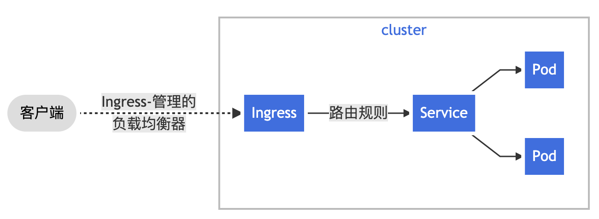

# Kubernetes

## Home works

### 本地运行一个k8s集群

创建Deployment：
```shell
$ kubectl apply -f simple-deployment.yaml
```
暴露服务：
```shell
$ kubectl create -f simple-service.yaml

$ minikube service simple-service
```
运行CronJob，要求k8s server version在1.21.0及以上：
```shell
$ kubectl create -f simple-cronjob.yaml
```
使用Ingress暴露API，[参考](https://kubernetes.io/zh/docs/tasks/access-application-cluster/ingress-minikube/)：
```shell
# 普通的启动方式不支持ingress插件，必须以如下方式启动，如果之前以普通方式启动过，必须先删掉之前的minikube镜像重新下载
$ minikube start --vm=true
$ minikube addons enable ingress

$ kubectl get pods -n ingress-nginx    
NAME                                        READY   STATUS      RESTARTS   AGE
ingress-nginx-admission-create-vphsg        0/1     Completed   0          16m
ingress-nginx-admission-patch-frdt4         0/1     Completed   0          16m
ingress-nginx-controller-5d88495688-fwchf   1/1     Running     0          16m

$ kubectl create -f simple-deployment.yaml
deployment.apps/simple-deployment created

$ kubectl create -f simple-service.yaml   
service/simple-service created

$ kubectl get service simple-service 
NAME             TYPE       CLUSTER-IP      EXTERNAL-IP   PORT(S)        AGE
simple-service   NodePort   10.102.10.234   <none>        80:32118/TCP   56s

$ minikube service simple-service --url
http://192.168.64.9:32118

$ kubectl apply -f simple-ingress.yaml 
ingress.networking.k8s.io/simple-ingress created

$ kubectl get ingress                 
NAME             CLASS    HOSTS                 ADDRESS   PORTS   AGE
simple-ingress   <none>   simple-service.info             80      14s

$ minikube ip       
192.168.64.9

$ kubectl create -f web2.yaml
$ kubectl create -f web2-service.yaml
$ kubectl apply -f simple-ingress.yaml

$ curl hello-k8s.zz/v2                                                   
Hello, world!
Version: 2.0.0
Hostname: web2-6c6cf9ffc5-bcz7j
```

### Questions
1. 简述 kubectl log / describe / apply / delete 命令的功能，[文档](https://kubernetes.io/zh/docs/reference/kubectl/overview/)
    - `kubectl logs`: 打印Pod中容器的日志，[文档](https://kubernetes.io/docs/reference/generated/kubectl/kubectl-commands#logs)
      
        ```shell
        # 从pod返回日志快照
        kubectl logs <pod-name>
        
        # 流式打印日志
        kubectl logs -f <pod-name> 
        ```
        
    -  `kubectl describe`：显示一个或多个资源的详细状态，[文档](https://kubernetes.io/docs/reference/generated/kubectl/kubectl-commands#describe)
    
        ```shell
        # 显示节点的详细信息
        kubectl describe nodes <node-name>
        
        # 显示pod的详细信息
        kubectl describe pods/<pod-name>
        
        # 显示由名为<rc-name>的副本控制器管理的所有pod的详细信息
        kubectl describe pods <rc-name>
        
        # 描述所有的pod，不包括未初始化的pod
        kubectl describe pods
        ```
    
    - `kubectl apply`：从文件或者标准输入为准，应用或更新资源，[文档](https://kubernetes.io/docs/reference/generated/kubectl/kubectl-commands#apply)
    
        ```shell
        # 使用 example-service.yaml 中的定义创建服务
        kubectl apply -f example-service.yaml
        
        # 使用 example-controller.yaml 中的定义创建 replication controller
        kubectl apply example-controller.yaml
        
        # 使用 <directory> 路径下任意 .yaml，.yml或 .json文件创建对象
        kubectl apply -f <directory>
        ```
    
    - `kubectl delete`：从文件、标准输入或指定标签选择器、名称、资源选择器或者资源中删除资源，[文档](https://kubernetes.io/docs/reference/generated/kubectl/kubectl-commands#delete)
    
        ```shell
        # 使用pod.yaml 文件中指定的类型和名称删除 pod
        kubectl delete -f pod.yaml
        
        # 删除所有带有 `<label-key>=<label-value>` 标签的 pod 和服务
        kubectl delete pods, services -l <label-key>=<label-value>
        
        # 删除所有 pod，包括未初始化的 pod
        kubectl delete pods --all
        ```
    
2. 简单描述 Pod，Node，Deployment，Service，Ingress，ReplicaSet，Namespace 概念

    - [Pod](https://kubernetes.io/zh/docs/concepts/workloads/pods/)

      Pod是可以在Kubernetes中创建和管理的、最小的可部署的计算单元。Pod是一组容器，它们共享存储、网络以及如何运行这些容器的声明。Pod共享的上下文包括一组Linux命名空间，控制组（cgroup）以及可能一些其他隔离容器的方面。

    - [Node](https://kubernetes.io/zh/docs/concepts/architecture/nodes/)

      节点是Pod运行的地方，节点可以是一个虚拟机或者物理机器，取决于集群的配置。每个节点包含运行Pods所需的服务。

    - [Deployment](https://kubernetes.io/zh/docs/concepts/workloads/controllers/deployment/)

      一个Deployment为Pods和ReplicaSets提供声名式的更新能力。Deployment描述了期望状态，Deployment控制器以受控速率改变实际状态，使其变为期望状态。

    - [Service](https://kubernetes.io/zh/docs/concepts/services-networking/service/)

      将运行在一组Pods上的应用程序公开为网络服务的抽象方法。

      Service定义了这样一种抽象：逻辑上的一组Pod，一种可以访问它们的策略——通常称为微服务。

    - [Ingress](https://kubernetes.io/zh/docs/concepts/services-networking/ingress/)

      Ingress是对集群中服务的外部访问进行管理的API对象，典型的访问方式是HTTP，可提供负载均衡，SSL和基于名称的虚拟托管。

      Ingress公开了从集群外部到集群内服务的HTTP和HTTPS路由，流量路由由Ingress资源上定义的规则控制。示例：

      

    - ReplicaSet
    
      ReplicaSet的目的是维护一组在任何时候都处于运行状态的Pod副本的稳定集合。因此，它通常用来保证给的数量的、完全相同的Pod的可用性。
    
    - Namespace
    
      Kubernetest支持在一个物理集群上运行多个虚拟集群，这些虚拟集群被称为命名空间。

## 遗留问题
1. 通过Ingress暴露出来的web页面访问有问题，直接通过Ip访问就没问题
